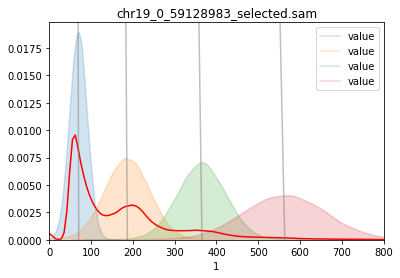

# GMM_guassian_mixture_model_to_ATAC-SEQ
Using a GMM model to separate reads from ATAC-seq experiment in diferent categories.  

THe model fit a gmm representing 4 types of nucleosome states:  
- Nucleosome free regions
- MonoNucleosome
- Diunucleosome
- Trinucleosome

-This model receives as an input is a BAM aligment file.   
